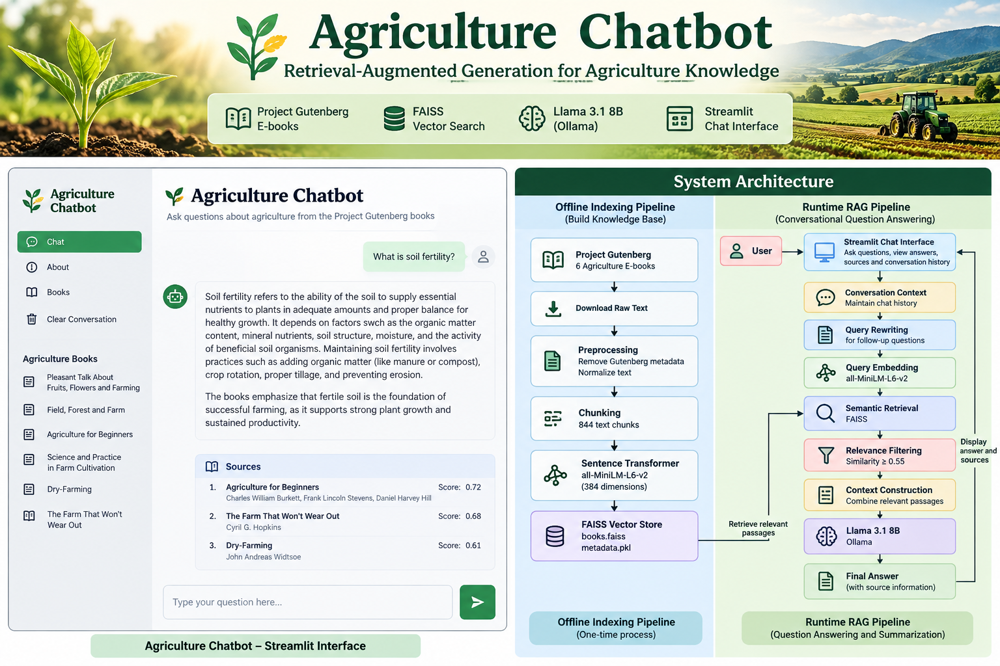
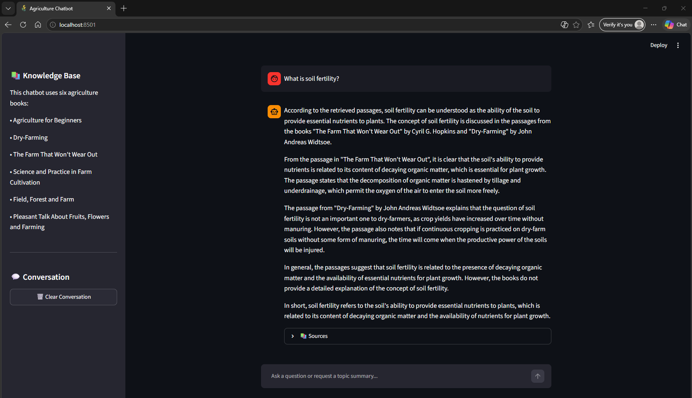
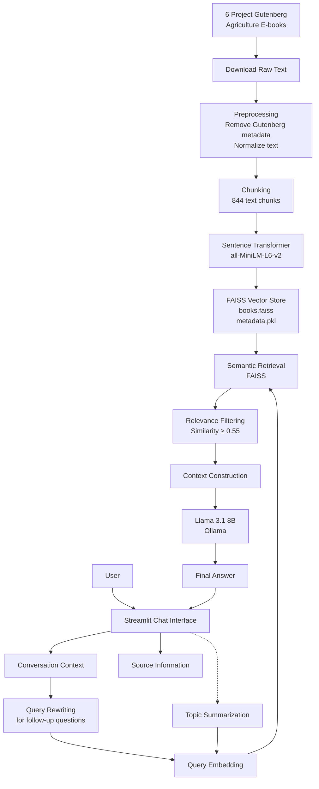

<p align="center">
  
</p>

# 🌾 Agriculture Chatbot

A conversational agriculture chatbot built using a static collection of agriculture e-books from Project Gutenberg.

The system uses **Retrieval-Augmented Generation (RAG)** to retrieve relevant information from the books and uses **Llama 3.1 8B** through Ollama to generate grounded answers.

The chatbot can answer questions, handle conversational follow-up questions, and summarize topics across the agriculture books.

---

## 1. Features

The chatbot supports:

- Question answering from the agriculture books
- Conversational follow-up questions
- Semantic search using FAISS
- Topic summarization across multiple books
- Source/book information for generated answers
- Relevance filtering to reduce unsupported answers
- A Streamlit-based chat interface
- Conversation history
- Clear conversation option
- Local LLM inference using Ollama
- Grounded responses based only on retrieved book passages

The system is designed to answer questions using the provided agriculture books rather than general external knowledge.

---

## 2. Chatbot Interface

The application provides a conversational interface for asking questions about the agriculture books.

<p align="center">
  
</p>

The interface displays the knowledge base, conversation history, generated answers, and source information.

---

## 3. Dataset

The assignment provided seven Project Gutenberg links. One book (`40190`) was listed twice, so the knowledge base contains **six unique books**.

### Books Used

#### 1. Pleasant Talk About Fruits, Flowers and Farming

**Author:** Henry Ward Beecher

https://www.gutenberg.org/ebooks/56640

#### 2. Field, Forest and Farm

**Author:** Jean-Henri Fabre

https://www.gutenberg.org/ebooks/67813

#### 3. Agriculture for Beginners

**Authors:** Charles William Burkett, Frank Lincoln Stevens, Daniel Harvey Hill

https://www.gutenberg.org/ebooks/20772

#### 4. Science and Practice in Farm Cultivation

**Author:** James Buckman

https://www.gutenberg.org/ebooks/40190

#### 5. Dry-Farming

**Author:** John Andreas Widtsoe

https://www.gutenberg.org/ebooks/4924

#### 6. The Farm That Won't Wear Out

**Author:** Cyril G. Hopkins

https://www.gutenberg.org/ebooks/4525

---

## 4. System Architecture

The system consists of two main stages:

1. **Offline indexing pipeline**
2. **Runtime conversational RAG pipeline**

### Architecture Diagram



---

## 5. RAG Workflow

The main Retrieval-Augmented Generation workflow is:

### Step 1 — Book Collection

The six agriculture books are obtained from Project Gutenberg.

### Step 2 — Preprocessing

The raw Gutenberg text is cleaned by:

- Removing Gutenberg start and end metadata
- Removing unnecessary credit text
- Normalizing line endings
- Normalizing whitespace
- Preserving paragraph structure

The cleaned books are stored in:

```text
data/processed/
```

### Step 3 — Chunking

The processed books are divided into smaller text chunks so that relevant passages can be retrieved efficiently.

The current dataset contains:

```text
844 chunks
```

The chunks are stored in:

```text
data/chunks.json
```

### Step 4 — Text Embeddings

Each chunk is converted into a numerical vector using:

```text
sentence-transformers/all-MiniLM-L6-v2
```

The embedding dimension is:

```text
384
```

### Step 5 — FAISS Vector Store

The embeddings are stored using FAISS for semantic similarity search.

The vector store contains:

```text
vectorstore/books.faiss
vectorstore/metadata.pkl
```

### Step 6 — User Query

The user enters a question through the Streamlit interface.

Example:

```text
How can soil fertility be maintained?
```

### Step 7 — Query Rewriting

For conversational follow-up questions, the system can use the conversation history to convert the question into a standalone search query.

Example:

```text
Previous question:
How can soil fertility be maintained?

Follow-up:
What about dry-farming?

Rewritten search query:
What is dry-farming?
```

This allows the retrieval system to better understand conversational references.

### Step 8 — Semantic Retrieval

The query is converted into an embedding using the same Sentence Transformer model.

FAISS then searches for the most semantically similar book passages.

### Step 9 — Relevance Filtering

Retrieved passages are filtered using a similarity threshold of:

```text
0.55
```

This helps prevent weakly related passages from being passed to the language model.

If no sufficiently relevant passages are found, the system returns a message indicating that the information could not be found in the agriculture books.

### Step 10 — Context Construction

The relevant passages are combined with their:

- Book title
- Author
- Relevance score
- Retrieved text

This information is provided to the language model as context.

### Step 11 — Answer Generation

The retrieved context is passed to:

```text
Llama 3.1 8B
```

using:

```text
Ollama
```

The model is instructed to answer using only the retrieved book passages.

### Step 12 — Final Response

The generated answer is displayed through the Streamlit interface together with the relevant source books.

---

## 6. Topic Summarization

The chatbot also supports topic-level summaries across the agriculture books.

Example:

```text
Summarize the main approaches to maintaining soil fertility across the books.
```

For summary requests, the system:

1. Searches the FAISS vector store.
2. Retrieves up to 8 relevant passages.
3. Applies the same relevance threshold.
4. Combines relevant passages from different books.
5. Sends the retrieved context to Llama 3.1 8B.
6. Generates a cross-book summary.

The summarization process is designed to mention only books for which relevant retrieved evidence is available.

---

## 7. Technologies

| Component | Technology |
|---|---|
| Programming Language | Python |
| User Interface | Streamlit |
| Large Language Model | Llama 3.1 8B |
| LLM Runtime | Ollama |
| Text Embeddings | Sentence Transformers |
| Embedding Model | all-MiniLM-L6-v2 |
| Vector Search | FAISS |
| Retrieval | Semantic Similarity Search |
| Architecture | Retrieval-Augmented Generation (RAG) |
| Data Source | Project Gutenberg |

---

## 8. Project Structure

```text
agriculture-chatbot/
│
├── assets/
│   ├── project-banner.png
│   └── chatbot-screenshot.png
│
├── data/
│   ├── raw/
│   │   ├── 20772.txt
│   │   ├── 40190.txt
│   │   ├── 4525.txt
│   │   ├── 4924.txt
│   │   ├── 56640.txt
│   │   └── 67813.txt
│   │
│   ├── processed/
│   │   ├── 20772.txt
│   │   ├── 40190.txt
│   │   ├── 4525.txt
│   │   ├── 4924.txt
│   │   ├── 56640.txt
│   │   └── 67813.txt
│   │
│   └── chunks.json
│
├── vectorstore/
│   ├── books.faiss
│   └── metadata.pkl
│
├── src/
│   ├── app.py
│   ├── build_index.py
│   ├── chunk_books.py
│   ├── download_books.py
│   ├── inspect_chunks.py
│   ├── llm.py
│   ├── preprocess.py
│   ├── rag.py
│   ├── rag_backup.py
│   ├── retriever.py
│   ├── test_rag.py
│   └── test_retrieval.py
│
├── .gitignore
├── requirements.txt
└── README.md
```

---

## 9. Main Components

### `download_books.py`

Downloads the Project Gutenberg books and stores the raw text files in:

```text
data/raw/
```

### `preprocess.py`

Cleans the downloaded Gutenberg text and removes unnecessary metadata.

Output:

```text
data/processed/
```

### `chunk_books.py`

Splits the processed books into smaller chunks for retrieval.

Output:

```text
data/chunks.json
```

### `build_index.py`

Creates embeddings for the chunks and builds the FAISS vector index.

Output:

```text
vectorstore/books.faiss
vectorstore/metadata.pkl
```

### `retriever.py`

Loads the FAISS index and embedding model and performs semantic search.

### `llm.py`

Connects the application to the locally running Ollama API.

### `rag.py`

Implements the main RAG functionality, including:

- Query rewriting
- Semantic retrieval
- Relevance filtering
- Context construction
- Answer generation
- Topic summarization

### `app.py`

Provides the Streamlit user interface.

---

## 10. Installation

### Clone the repository

```bash
git clone https://github.com/chalithalumbini/agriculture-chatbot.git
cd agriculture-chatbot
```

### Create a virtual environment

On Windows PowerShell:

```powershell
python -m venv .venv
```

Activate it:

```powershell
.\.venv\Scripts\Activate.ps1
```

### Install dependencies

```powershell
pip install -r requirements.txt
```

---

## 11. Ollama Setup

The chatbot uses **Llama 3.1 8B** through Ollama.

Install Ollama and download the model:

```powershell
ollama pull llama3.1:8b
```

Verify that the model is available:

```powershell
ollama list
```

The expected model is:

```text
llama3.1:8b
```

Ollama should be running locally before starting the chatbot.

---

## 12. Building the Knowledge Base

If the raw books need to be downloaded again:

```powershell
python src/download_books.py
```

Run preprocessing:

```powershell
python src/preprocess.py
```

Create the chunks:

```powershell
python src/chunk_books.py
```

Build the FAISS vector index:

```powershell
python src/build_index.py
```

This creates:

```text
vectorstore/books.faiss
vectorstore/metadata.pkl
```

---

## 13. Running the Chatbot

Start the Streamlit application:

```powershell
streamlit run src/app.py
```

The application will open in a browser.

The interface provides:

- Chat-based interaction
- Conversation history
- Follow-up questions
- Topic summarization
- Source information
- Clear conversation option

---

## 14. Example Questions

### General Questions

```text
What is soil fertility?
```

```text
Why is nitrogen important for plants?
```

```text
What is dry-farming?
```

### Conversational Questions

```text
How can soil fertility be maintained?
```

Followed by:

```text
What about dry-farming?
```

### Topic Summarization

```text
Summarize the main approaches to maintaining soil fertility across the books.
```

---

## 15. Testing

The project includes test scripts for retrieval and RAG functionality.

### Test retrieval

```powershell
python src/test_retrieval.py
```

### Test RAG

```powershell
python src/test_rag.py
```

The system was tested with agriculture-related questions, conversational follow-ups, topic summaries, and questions outside the knowledge base.

For questions unrelated to the agriculture books, the relevance filtering mechanism can prevent unrelated retrieved passages from being used to generate an answer.

---

## 16. Grounding and Relevance Control

A key part of the system is ensuring that answers are grounded in the provided books.

The chatbot uses a similarity threshold:

```text
0.55
```

Retrieved passages below this threshold are discarded.

If no passages meet the threshold, the chatbot returns:

```text
I couldn't find relevant information about this question in the agriculture books.
```

This prevents the language model from generating an answer based on unrelated retrieved content.

The generation prompt also instructs the model to:

- Use only retrieved passages
- Avoid outside knowledge
- Avoid inventing information
- State when the retrieved information is insufficient
- Mention relevant books when appropriate

---

## 17. Conversation Handling

The chatbot maintains recent conversation history.

This allows follow-up questions such as:

```text
User:
How can soil fertility be maintained?

Assistant:
...

User:
What about dry-farming?
```

The system detects common follow-up expressions and uses the conversation history to rewrite the question into a standalone search query.

This improves retrieval for conversational interactions while avoiding an unnecessary LLM call for questions that are already standalone.

---

## 18. Limitations

The current implementation has several limitations:

- The knowledge base is limited to the six provided agriculture books.
- The chatbot does not perform live web searches.
- Answers depend on the quality of semantic retrieval.
- The local Llama 3.1 8B model runs through Ollama and may be slower on CPU-only systems.
- Historical agriculture texts may not represent modern agricultural practices.
- The chatbot cannot answer questions when sufficiently relevant information cannot be retrieved from the books.

---

## 19. Future Improvements

Possible future improvements include:

- Improved chunking based on book chapters and sections
- Hybrid keyword + semantic retrieval
- Reranking retrieved passages
- Better source citations with page or chapter information
- More advanced conversation-aware retrieval
- Evaluation using a dedicated question-answering dataset
- Retrieval and answer-quality metrics
- Support for additional agriculture books
- GPU-based LLM inference for faster responses
- Improved topic summarization across larger collections

---

## 20. Conclusion

This project implements a conversational agriculture question-answering system using a **Retrieval-Augmented Generation architecture**.

The system combines:

```text
Project Gutenberg Books
        |
        v
Preprocessing
        |
        v
Chunking
        |
        v
Sentence Transformer Embeddings
        |
        v
FAISS Semantic Retrieval
        |
        v
Relevance Filtering
        |
        v
Llama 3.1 8B
        |
        v
Streamlit Chat Interface
```

The resulting chatbot can answer questions from the provided agriculture books, handle conversational follow-up questions, and generate summaries across multiple books while keeping generated responses grounded in retrieved source material.

---

## Repository

GitHub: https://github.com/chalithalumbini/agriculture-chatbot
